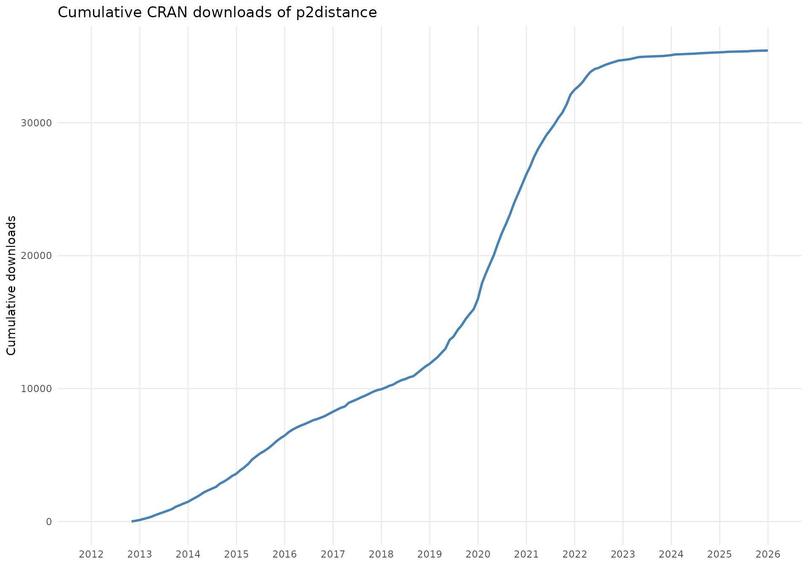

# Impact

``` r

library(p2distance)
```

## Downloads

Since being restored to CRAN, `p2distance` downloads are tracked via the
`cranlogs` package. The plot below shows cumulative downloads over time



## Citing works

The following peer-reviewed studies have used `p2distance` to compute
synthetic well-being, competitiveness, or sustainability indicators,
listed in chronological order.

Is your work missing from this list? [Open an
issue](https://github.com/ajpelu/p2distance/issues) or send a pull
request adding it.

Bonet-García, F. J., Pérez-Luque, A. J., Moreno-Llorca, R. A.,
Pérez-Pérez, R., Puerta-Piñero, C., & Zamora, R. (2015). Protected areas
as elicitors of human well-being in a developed region: A new synthetic
(socioeconomic) approach. *Biological Conservation*, *187*, 221–229.
https://doi.org/<https://doi.org/10.1016/j.biocon.2015.04.027>

Carradore, M. (2025). Social capital in the italian regions at the time
of the COVID-19 pandemic: A comparison of different composite
indicators. *International Review of Sociology*, *35*(1), 89–106.
<https://doi.org/10.1080/03906701.2024.2448945>

Ciacci, A., Ivaldi, E., & González-Relaño, R. (2021). A partially
non-compensatory method to measure the smart and sustainable level of
italian municipalities. *Sustainability*, *13*(1), 435.
<https://doi.org/10.3390/su13010435>

Merino Llorente, M. C., Somarriba Arechavala, N., & García Prieto, C.
(2023). European workers’ health and well-being: Do gender gaps persist
between 2010 and 2015? *Revista de Economía Mundial*, (63), 117–137.
<https://doi.org/10.33776/rem.vi63.7207>

Pérez-Luque, A. J., Moreno-Llorca, R. A., Pérez-Pérez, R., &
Bonet-García, F. J. (2016). Temporal analysis of wellbeing in the
municipalities of Sierra Nevada. In R. Zamora, A. Pérez-Luque, F. Bonet,
J. Barea-Azcón, & R. Aspizua (Eds.), *Global change impacts in Sierra
Nevada: Challenges for conservation* (pp. 186–187). Consejería de Medio
Ambiente y Ordenación del Territorio. Junta de Andalucía.

Sánchez de la Vega, J. C., Buendía Azorín, J. D., Calvo-Flores Segura,
A., & Esteban Yago, M. (2019). A new measure of regional
competitiveness. *Applied Economic Analysis*, *27*(80), 108–126.
<https://doi.org/10.1108/AEA-07-2019-0010>

Somarriba Arechavala, N., & Zarzosa Espina, P. (2016). Quality of life
in latin America: A proposal for a synthetic indicator. In G. Tonon
(Ed.), *Indicators of quality of life in latin America* (pp. 19–56).
Springer International Publishing.
<https://doi.org/10.1007/978-3-319-28842-0_2>
